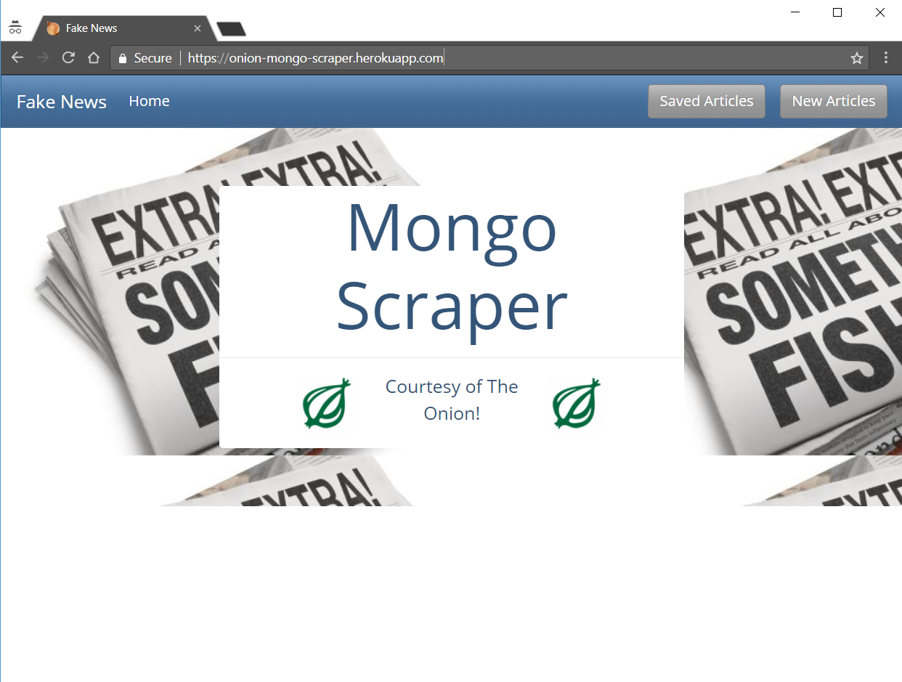
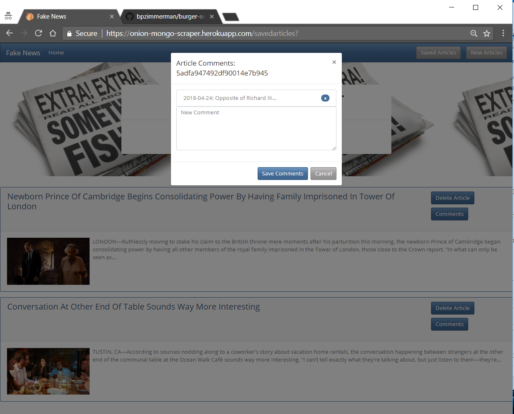

# Fake News (The Onion) Scraper

This application uses Cheerio to scrape the articles from [The Onion](https://www.theonion.com). It allows users to save articles to a MongoDB and allows comments to be attached to the saved articles.

### Instructions

1. The application is located as follows:

   * Heroku deployment: [The Onion Mongo Scraper](https://onion-mongo-scraper.herokuapp.com/)

   * GitHub repository: [The Onion Mongo Scraper GitHub Repository](https://github.com/bpzimmerman/fake-news)

#### New Articles

1. Clicking the `New Articles` button will scrape the articles off The Onion website and display the headlines linked to the full story on The Onion website. A picture (if available) and summary (if available) of the article are also displayed.

2. Clicking the `Save Article` button next to the article headline will save the article's information into a Mongo Database.

#### Saved Articles

1. Clicking the `Saved Articles` button will pull the saved information from the Mongo Database and display the articles as before except with two buttons `Delete Article` and `Comments`.

2. Clicking the `Delete Article` button will remove the article and all associated comments from the database.

#### Comments

1. Clicking the `Comments` button will open a modal that will allow the user to add a comment to the article. Multiple comments can be associated with the same article and will display in a list just above the new comment text box.

2. Clicking the `x` next to the comment will remove just that comment from the database.

